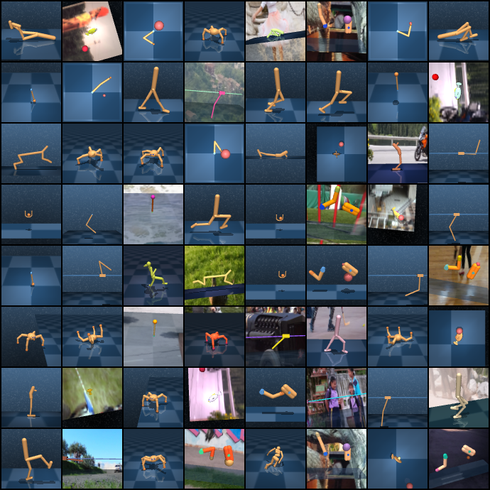
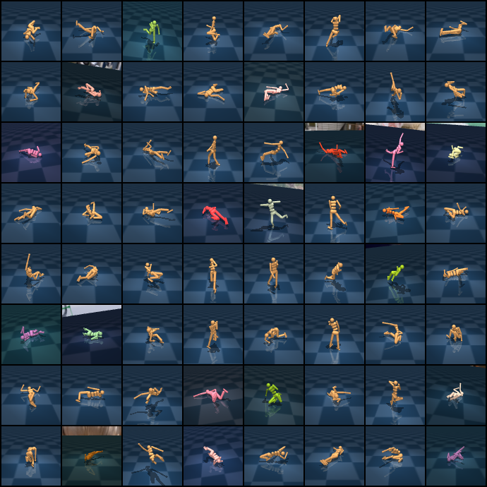
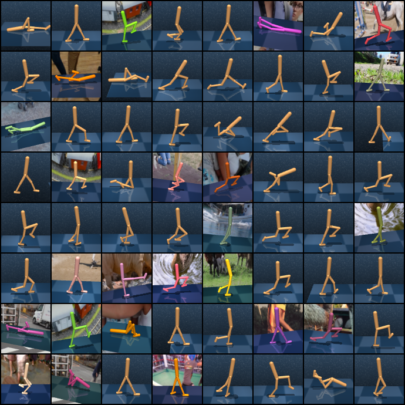

# DMControl Pretraining

Code for generating and using DMControl data with TD-MPC. Models are available for 26 tasks and 3 seeds each (1, 2, 3). Each trajectory consists of 500 frames, states, actions, and rewards, as well as metadata such as expert actions and the full configuration file. Trajectories are saved as dictionaries in PyTorch files with the `.pt` extension. See the google docs for more details.

## Generating data

Run script `scripts/get_demos.sh`. This will download pretrained TD-MPC models and generate trajectories. Additional arguments can be found in `src/dataloader.py` and `cfgs/`. This script runs sequentially and takes ~1 day to run, but can be parallelized to take ~1 hour on 60 GPUs.

## Using the dataloader

Example code in `src/dataloader.py`. Can also be run with `scripts/dataloader.sh` once the data directory is set.

## Samples

#### All

#### Humanoid, expert/distractors

#### Walker, expert/distractors

