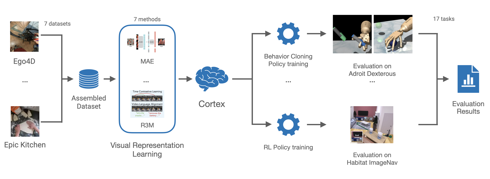

# Cortexbench

CORTEXBENCH is a collection of 17 EAI tasks drawn from 7 existing benchmarks, designed to assess the efficacy of pre-trained visual representations (PVRs) in supporting a variety of EAI applications. Each task includes a downstream policy learning paradigm and evaluation protocol adhering to community standards. By using fixed tasks and learning methods, CORTEXBENCH evaluates the contribution of PVRs and measures progress towards developing an artificial visual cortex for embodied intelligence. This benchmark conducts the largest and most comprehensive study of PVRs to-date.

CORTEXBENCH includes tasks from 7 diverse benchmarks with different combinations of observations, actions, and goals as well as different standard policy learning paradigms:

| **Benchmark Suite** | **Observation Space** | **Action Space** | **Goal Specification** | **Policy Learning** |
|----------------------|--------------------------|----------------------|---------------------------|-------------------|
| [Adroit](./mujoco_vc#adroit-benchmark) | RGB + proprio. | Continuous | - | IL |
| [Metaworld](./mujoco_vc#metaworld-benchmark) | RGB + proprio. | Continuous | - | IL |
| [DMControl](./mujoco_vc#deepmind-control-benchmark) | RGB + proprio. | Continuous | - | IL |
| [Trifinger](./trifinger_vc) | RGB + proprio. | Continuous | Goal Image/Position | IL |
| [ObjectNav](./habitat_vc#objectnav) | RGB + proprio. | Discrete | Object Category | IL |
| [ImageNav](./habitat_vc#imagenav) | RGB | Discrete | Goal Image | RL |
| [MobilePick](./habitat2_vc) | RGB + proprio. | Continuous | Goal Position | RL |

## Installation

To install CortexBench, please follow the instructions in [../INSTALLATION.md](../INSTALLATION.md).

## Datasets

Benchmarks from CortexBench use datasets described in [DATASETS.md](DATASETS.md).