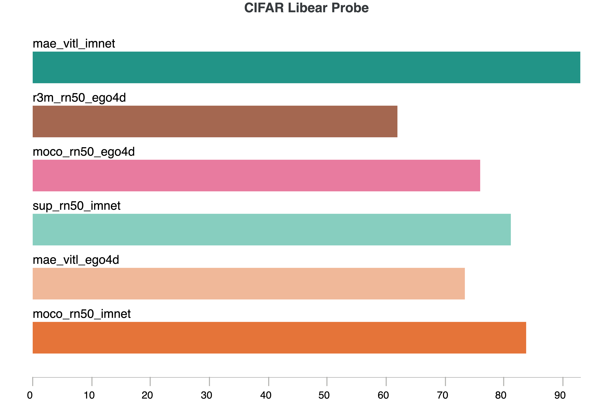

## CIFAR-10 Classification

We will use CIFAR-10 classification as a quick and simple computer vision task for evaluating different pre-trained models. We will evaluate in both the linear probing as well as full model finetuning (TODO) settings.

To launch a linear probing experiment on the cluster with multiple models, use the following command:
<!-- ```
# From repo root directory
python eval/cifar_lin_probe/run_cifar_lin_probe.py -m +hydra/launcher=submitit_slurm \
  model=moco,moco_ego4d,mae_large,mae_large_ego4d,r3m,vip,rn50_sup_imnet
``` -->
```
# From repo root directory
python eval/cifar_lin_probe/run_cifar_lin_probe.py -m +hydra/launcher=submitit_slurm \
  model=moco_resnet50_imagenet,moco_resnet50_ego4d,mae_vit_large_patch16_imagenet,mae_vit_large_patch16_ego4d,r3m_resnet50_ego4d,vip_resnet50_ego4d,sup_resnet50_imagenet
```

This should launch 6 experiments in parallel and would take about 10 minutes to complete after launching. The results will be stored in `/checkpoint/yixinlin/eaif/results/${hydra.job.name}/${oc.env:USER}` as specified in the hydra config. The final results should look something like below.


