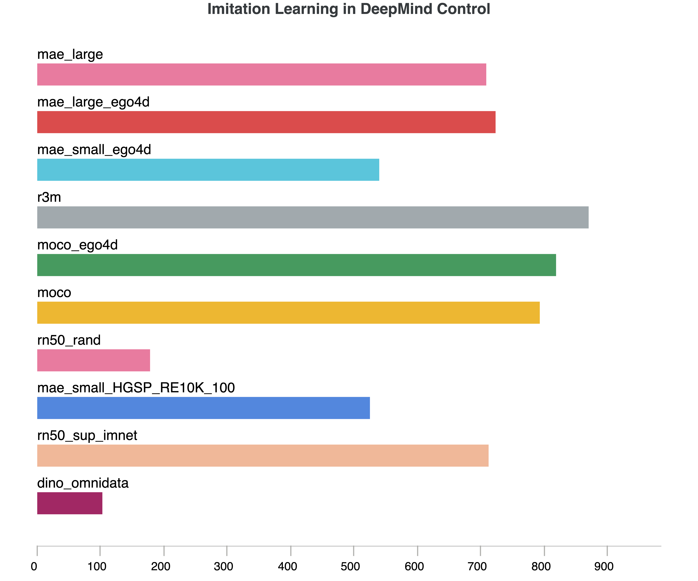

## EAIF MuJoCo Evaluations
Evaluation of models in various benchmarks simulated with MuJoCo.

We currently support few-shot visual imitation learning as an evaluation methodology, and our experiment design is based on the [PVR paper](https://sites.google.com/view/pvr-control).

### Unit tests
Basic unit tests that loop over relevent environments and model_zoo are available with the package. These tests check the model integrity by loading and verifying the embedding dimension.
```bash
export DISPLAY=:100  # Requires a VNC server if headless
pytest eval/eaif_mujoco/tests
```

### Running experiments
Navigate to the `visual_imitation` subdirectory to find launch scripts and config files.
```
cd eai-foundations/eval/eaif_mujoco/visual_imitation/config
```
You can spawn an array job by following the below commands or looking into the `launch_all_jobs.sh` script.
```
python hydra_launcher.py --config-name DMC_BC_config.yaml --multirun hydra/launcher=slurm \
  env=dmc_walker_stand-v1,dmc_walker_walk-v1,dmc_reacher_easy-v1,dmc_cheetah_run-v1,dmc_finger_spin-v1 \
  embedding=dino_omnidata,mae_large,mae_large_ego4d,mae_small_HGSP_RE10K_100,mae_small_ego4d,moco,moco_ego4d,r3m,rn50_rand,rn50_sup_imnet
```
Below is an example of the runs (DM Control, 5 tasks)
<!--  -->
<style>
img {
  display: block;
  margin-left: auto;
  margin-right: auto;
}
</style>

