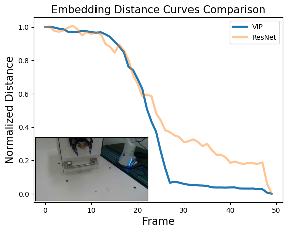
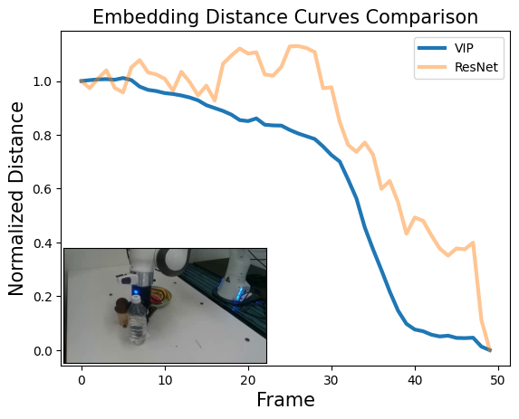
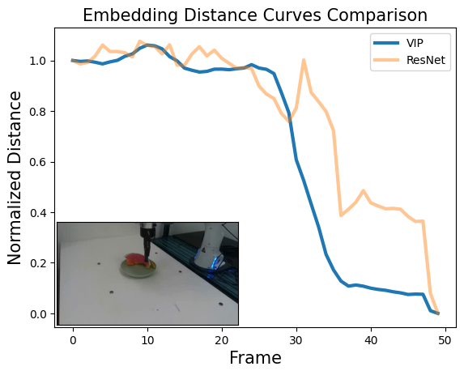
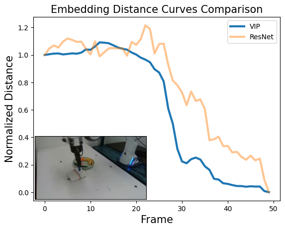

# VIP: Towards Universal Visual Reward and Representation via Value-Implicit Pre-Training

#### [[Project Page]](https://sites.google.com/view/vip-rl/) [[Paper]](https://arxiv.org/abs/2210.00030)

[Jason Yecheng Ma](https://www.seas.upenn.edu/~jasonyma/)<sup>12</sup>, [Shagun Sodhani](https://shagunsodhani.com/)<sup>1</sup> [Dinesh Jayaraman](https://www.seas.upenn.edu/~dineshj/)<sup>2</sup>, [Osbert Bastani](https://obastani.github.io/)<sup>2</sup>, {[Vikash Kumar*](https://vikashplus.github.io/)<sup>1</sup>, [Amy Zhang*](https://amyzhang.github.io/)<sup>1</sup>}

<sup>1</sup>Meta AI, <sup>2</sup>University of Pennsylvania

This is the official repository for VIP, a self-supervised zero-shot visual reward and representation for downstream unseen robot tasks. This repository contains examples for using the pre-trained VIP model as well as training VIP from scratch using any custom video dataset.


## Installation
Create a conda environment where the packages will be installed.
```
conda create --name vip python=3.9
conda activate vip
```
Then, in the root directory of this repository, run:
```
pip install -e . 
```

## VIP Usage Examples

To load the VIP model pre-trained on Ego4D, simply do:
```
from vip import load_vip
vip = load_vip()
vip.eval()
```
Example code to use the released VIP representation is located [here](https://github.com/facebookresearch/vip/blob/main/vip/examples/encoder_example.py).

We have also included an example for generating embedding distance curves as in our paper using our real-robot demonstrations. You can try it here:
```
cd vip/examples
python plot_reward_curves.py
```
This should generate the following plots in `vip/examples/embedding_curves/`:

<p float="left">




</p>

In addition to this official repository, VIP has also been incorporated into [TorchRL](https://github.com/pytorch/rl) as an out-of-box visual representation for any Gym environment. After you install TorchRL, using VIP is as simple as:
```
from torchrl.envs.transforms import VIPTransform
env = TransformedEnv(my_env, VIPTransform(keys_in=["next_pixels"], download=True)
```

## Training VIP Representation
Our codebase supports training VIP on both the Ego4D dataset that was used in pre-training our released VIP model as well as any custom video dataset. The video dataset directory should use the following structure:
```
my_dataset_path/
    video0/
        0.png
        1.png
        ...
    video1/
    video2/
    ...
```
Then, you can train VIP on your dataset by running:
```
python train_vip.py --config-name=config_vip dataset=my_dataset_name datapath=my_dataset_path
```

For Ego4D or equivalent large-scale pre-training, we suggest using config ``config_vip_ego4d.yaml`` (the config for the released VIP model):
```
python train_vip.py --config-name=config_vip_ego4d dataset=ego4d datapath=ego4d_dataset_path
```

## License

The source code in this repository is licensed under the CC BY-NC 4.0 License.

## Citation
If you find this repository or paper useful for your research, please cite
```
@article{ma2022vip,
  title={VIP: Towards Universal Visual Reward and Representation via Value-Implicit Pre-Training},
  author={Ma, Yecheng Jason and Sodhani, Shagun and Jayaraman, Dinesh and Bastani, Osbert and Kumar, Vikash and Zhang, Amy},
  journal={arXiv preprint arXiv:2210.00030},
  year={2022}
}
```

## Ackowledgements

Parts of this code are adapted from the R3M [codebase](https://github.com/facebookresearch/r3m).
